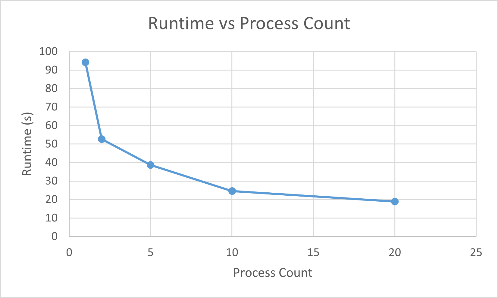

# System Programming Lab 11 Multiprocessing

### Overview:
The file mandelmovie.c can be compiled to create an executable. This executable takes a command line argument with flag `-n <processes>` where the value after the `-n` is the number of processes you would like to run the program with. Running the program will create 50 images of a mandelbrot fractal in slightly different positions. No `-n` argument will cause the program to default to 1 calculating process. In my implementation the parent does not generate any images itself, but rather manages child processes to do the image generation.

### Plotting Runtime vs Number of Processes:

After running the program at different process counts these were my runtime results. This flattening of the curve makes sense as there are only 16 logical processors in my laptop, so exceeding that number yields minimal benefit.